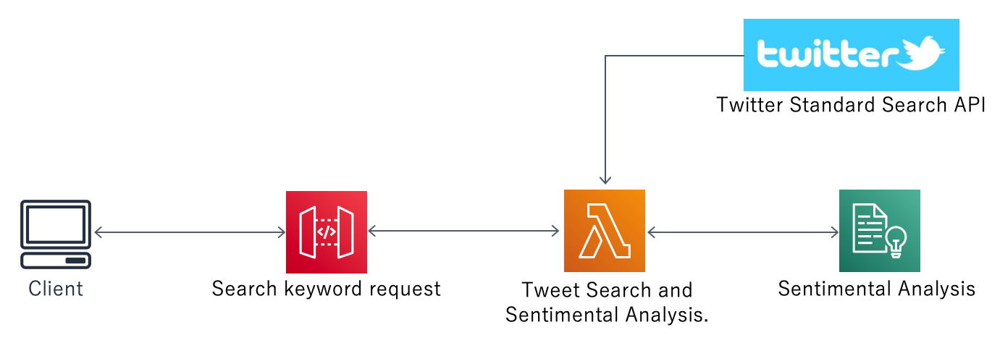

# Twitter-Analysis-for-AwsLambda

This program analyzes the results of the "Twetter Sarech API" with "Amazon Comprehend" and responds in Json format.  
These consist of the "AWS Lambda" and "Amazon API Gateway" services and are builed and deployed using the AWS SAM (Serverless Application Model) template file.
 

## Requirements

* AWS CLI already configured with Administrator permission
* [Docker installed](https://www.docker.com/community-edition)
* [Golang](https://golang.org)
* [Twitter Api keys](https://developer.twitter.com/en)

## Setup process

### Twitter API Keys Setup
Embed your "Twitter API" authentication key in the "Environment" of "AWS::Serverless::Function" in the AWS SAM template file.
```yaml
  Environment:
    Variables:
      TWITTER_CONSUMER_KEY: [TWITTER_CONSUMER_KEY]
      TWITTER_CONSUMER_SECRET: [TWITTER_CONSUMER_SECRET]
      TWITTER_ACCESS_TOKEN: [TWITTER_ACCESS_TOKEN]
      TWITTER_ACCESS_SECRET: [TWITTER_ACCESS_SECRET]
```

### Building

```shell
 sam build  -g
````


### Deploy

```shell
 sam deploy
````
## API Request
```shell
 curl https://[ServerlessRestApi].execute-api.[AWSRegion].amazonaws.com/Prod/TwitterAnalysis?twquery=[SarechAndAnalysisKeyword]
````

## API Response Json Fromat
Response sentiment value [ "positive" + "negative" + "mixed" + "neutral" = 1.0]

````
{
    "tweet": [
        {
           "id": "TwitterID",
           "screen_name": "Twitter accant name",
           "name": "Show name",
           "created_at": "Tweet created time (JST) yyyy-MM-ddTHH:mm:ss+09:00",
           "text": "Tweet text (Whitespace and line feed codes[\n] are excluded)"
        }
     ],
    "sentimental": [
        {
          "sentiment": "POSITIVE|NEGATIVE|MIXED|NEUTRAL",
          "positive": Positive sentiment value (0<= thisValue <= 1),
          "negative": negative sentiment value (0<= thisValue <= 1) ,
          "mixed": mixed sentiment value (0<= thisValue <= 1),
          "neutral": neutral sentiment value (0<= thisValue <= 1)
        }
    ]
}
````
